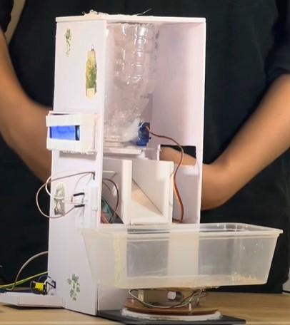
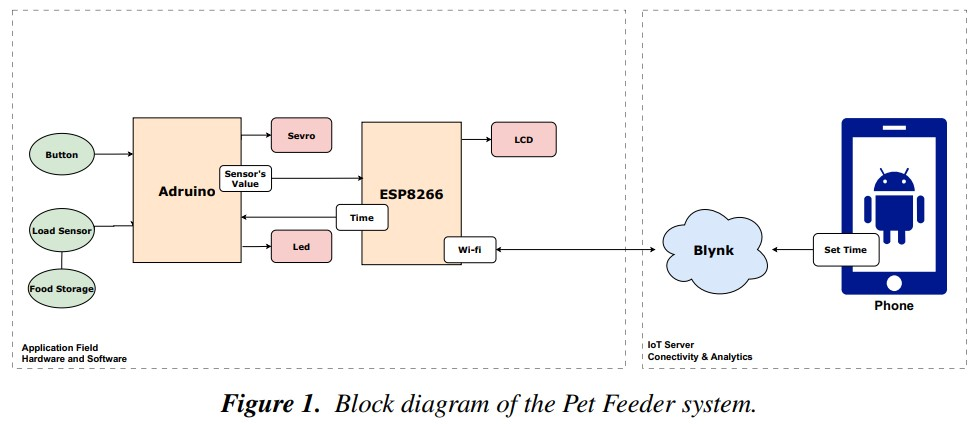
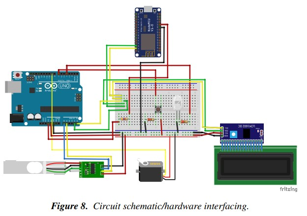
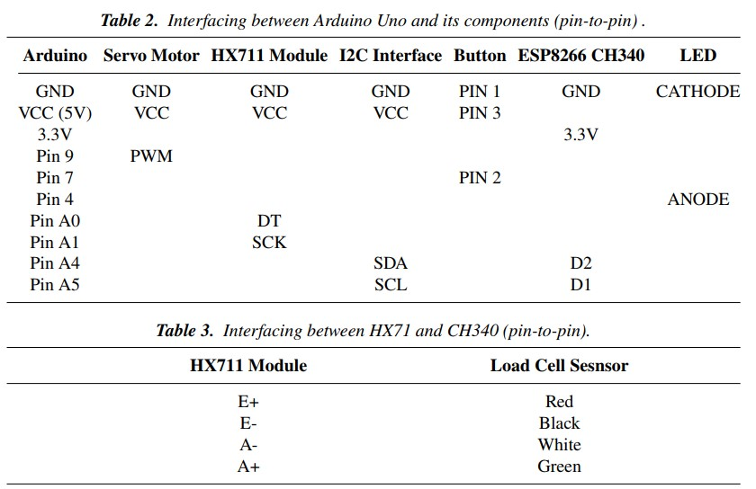
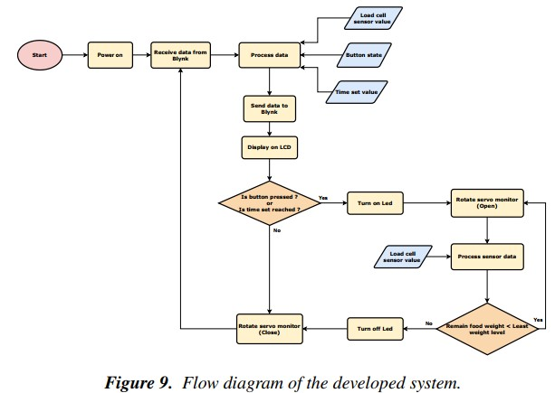
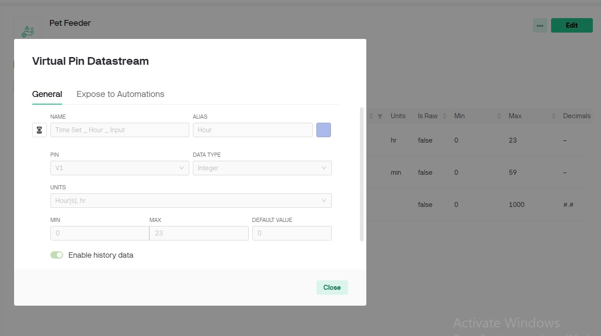
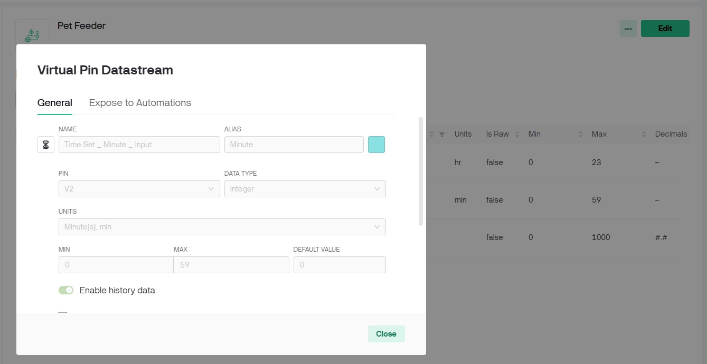
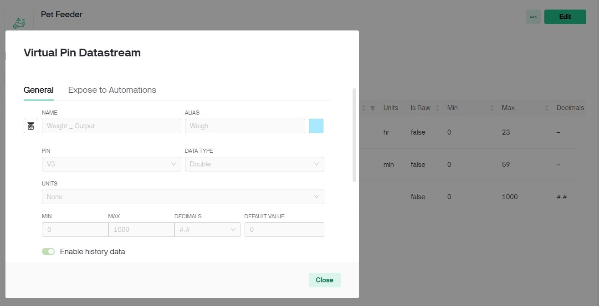

# IOT - Pet Feeder System 🐶🐱

> **Dự án cuối kì của môn học IOT102t**  
> **Nhóm 5 - Lớp SE1840, Kỳ FA24, Đại học FPT**

## 📋 Mục lục

1. [Mục tiêu](#-mục-tiêu)
2. [Thành viên nhóm](#-thành-viên-nhóm)
3. [Thiết bị](#️-thiết-bị)
4. [Thiết kế hệ thống](#️-thiết-kế-hệ-thống)
   - [Block Diagram](#1-block-diagram)
   - [Schematic Design](#2-schematic-design)
5. [Flowchart](#-flowchart)
6. [Thư viện sử dụng](#-thư-viện-sử-dụng)
7. [Cài đặt trên Blynk](#-cài-đặt-trên-blynk)
8. [Hạn chế](#-hạn-chế)
9. [Phụ lục](#-phụ-lục)

---

## 🚀 Mục tiêu

Dự án này hướng đến việc giúp cho thú cưng ăn theo hai cách:

- **Chủ động**: Nhấn nút trên hệ thống để cho ăn.
- **Tự động**: Lập trình thời gian trên ứng dụng Blynk để thú cưng tự động được cho ăn.

---

## 👨‍👩‍👧‍👦 Thành viên nhóm

| **Tên**                   | **Thông tin liên hệ**                                                     |
| ------------------------- | ------------------------------------------------------------------------- |
| **Lê Tiến Đạt**           | [Github](https://github.com/datle-gh) · Email: datletien1352004@gmail.com |
| **Nguyễn Hữu Đạt**        | [Github](https://github.com/datle-gh) · Email: datnhqe180140@fpt.edu.vn   |
| **Cung Nguyễn Bích Trâm** | Email: tramcnbse184306@fpt.edu.vn                                         |
| **Trần Mạnh Tuấn**        | Email: tuantmse180360@fpt.edu.vn                                          |

> **Giảng viên hướng dẫn**: Lê Vũ Trường (TruongLV2)

---

## ⚙️ Thiết bị

- Arduino Uno
- ESP8266
- Load Cell Sensor (Cảm biến cân nặng) + Khung bàn cân
- LED
- Button
- Điện trở 2 x 220Ω và 1 x 100kΩ
- LCD 1602 (kèm I2C Adapter Module)

---

## 🛠️ Thiết kế hệ thống

### 1. **Block Diagram**

### 2. **Schematic Design**

  
  

---

## 📈 Flowchart

**Quy trình hoạt động:**

1.  Đầu tiên, hệ thống sẽ lấy dữ liệu về time set từ trên phía Blynk xuống thông qua kết nối wifi của Esp8266
2.  Lấy dữ liệu từ các cảm biến và nút:

- Load cell: cân nặng của đồ ăn
- Button State: trạng thái nút (nhấn - HIGH/không nhấn - LOW)
- Time set value: thời gian đã cài lấy tín hiệu từ phía Esp8266 liệu đã đến thời điểm hay chưa (true/false)

3. Gửi lại dữ liệu về cân nặng cho Esp8266 để nó có thể gửi lên Blynk
4. Hiển thị thời gian đã cài lên màn hình LCD
5. Kiểm tra điều kiện để đổ thức ăn:

- Nếu nút vừa được nhấn hoặc có tín hiệu về việc đã đến thời gian cài time set:
  - Bật đèn LED
  - Xoay servo (mở cửa đồ ăn)
  - Đo lại cân nặng của đồ ăn
  - Gửi lại data của cân nặng cho Esp8266 để gửi lên Blynk
  - Kiểm tra lại xem lượng đồ ăn tối đa đã cài hay chưa
    - Nếu chưa thực hiện lại 4 bước trên để tiếp tục cho ăn
    - Nếu đã đạt đến:
      - Tắt đèn
      - Xoay servo (Đóng cửa đồ ăn)
- Nếu nút không được bấm hoặc không có tín hiệu về việc đã đến thời gian cài time set:
  - Giữ nguyên servo

6. Quay lại từ số 1

---

## 📚 Thư viện sử dụng

| **Tên**                  | **Nguồn**                                            |
| ------------------------ | ---------------------------------------------------- |
| **HX711.h**              | https://github.com/bogde/HX711.git                   |
| **Servo.h**              | Tích hợp sẵn trên Arduino IDE                        |
| **Wire.h**               | Tích hợp sẵn trên Arduino IDE                        |
| **NTPClient.h**          | https://github.com/arduino-libraries/NTPClient.git   |
| **BlynkSimpleEsp8266.h** | Thư viện con của Blynk, tải trên Arduino IDE         |
| **LiquidCrystal_I2C.h**  | https://github.com/johnrickman/LiquidCrystal_I2C.git |

---

## 📲 Cài đặt trên Blynk

### Virtual Pins:

- **V1**: Giờ đặt thời gian.  
  
- **V2**: Phút đặt thời gian.  
  
- **V3**: Hiển thị khối lượng thức ăn.  
  

---

## ⚠️ Hạn chế

- Do sử dụng đầu chai nước 500ml để làm phần đựng thức ăn cũng như là phần đổ thức ăn nên các dạng thức ăn hạt lớn rất dễ kẹt ở đầu chai
- Sử dụng đồ ăn không hợp lý cho demo:
  - **Ngũ cốc calbee**: dễ kẹt ở cổ chai
  - **Gạo**: trôi ra quá nhanh so với dự kiến khiến cho cân nặng đo được dễ bị lệch
  - **Giấy vo viên**: quá nhẹ mà viên vo lại có kích khá to
  - **Sỏi** (lựa chọn demo của nhóm): một viên bé có cân nặng đáng kể, dễ trôi nhanh như gạo làm cân nặng dễ bị lệch
- Còn hard code về cân nặng cao nhất để ngừng đổ thức ăn
- Còn cần phải truyền điện qua dây cho ESP8266 và arduino
- ESP8266 và arduino được kết nối qua dây vật lý
- Màn hình LCD chỉ hiện thông tin về thời gian đã cài
- Cân nặng Load cell sensor không được ổn định khi đo. Vẫn phải tìm chỉ số hiệu chỉnh CALIBRATING sau khi đổi máng thức ăn và khi máng thức ăn bị nhắc ra khỏi cân

---

## 📖 Phụ lục

### 1. **Tài liệu tham khảo**

- Giao thức kết nối giữa Arduino và ESP8266: https://hocarm.org/giao-tiep-esp8266-nodemcu-voi-arduino-uno-mega/
- CH340 driver cho việc nạp code ESP8266: (Link offical) https://www.wch.cn/download/CH341SER_EXE.html

### 2. **Thông tin bổ sung**

- Nhóm sử dụng giao thức I2C để kết nối giữa arduino và ESP8266 sau một thời gian cố gắng sử dụng giao thức UART không thành công

---
